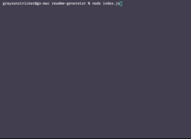
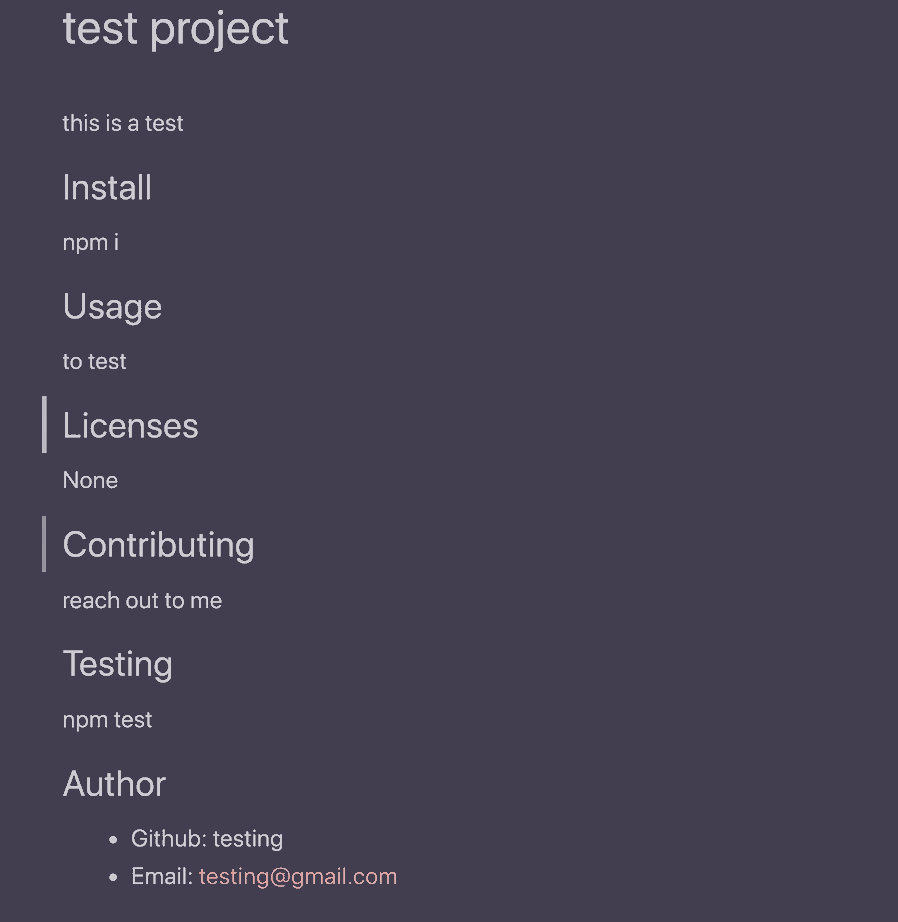

# Readme Generator

CLI that generates minimalistic README.md files.

## Demo

## Install

npm i

## Usage

This project is used to simplify and streamline the process of adding readme files to github repos.

## Licenses

None

## Contributing

Please reach out to me directly for contributions, issues and features requests. Your input is welcome!

## Author

- Github: g-strick
- Email: graysonstricker@gmail.com
